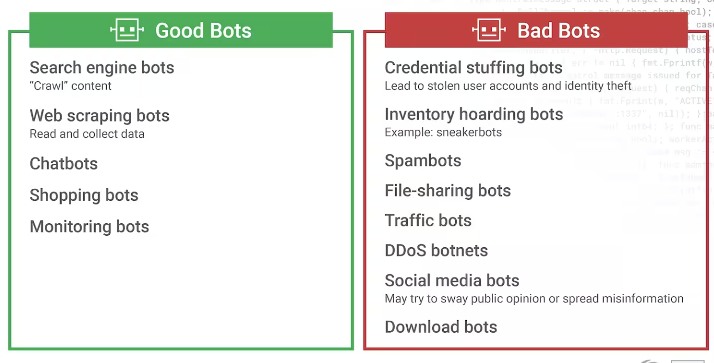
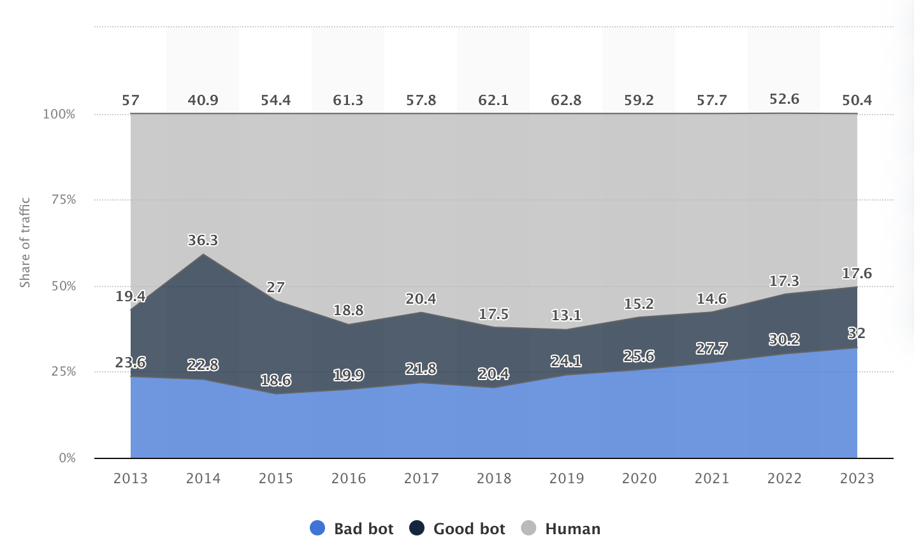

# What is Bot Detection?
Bot detection is the process of identifying and distinguishing between automated bots and human users, using techniques such as behavior analysis, device fingerprinting, CAPTCHAs, machine learning, and threat intelligence to mitigate bot-driven threats. Bot detection is increasingly important because some estimates indicate that bad bots now constitute nearly half of all internet traffic. Since they can be powerful tools in delivering web services at scale and low cost, they are similarly exploited by bad actors looking to maximize their profits. The ability to launch thousands of digital attacks in parallel makes bots much more scalable than humans. This also makes it possible for cybercriminals with little or no technical knowledge to trigger large-scale attacks. 
Bot detection technology is key to knowing which bots you can trust, and which must be blocked to protect your organization, your data, and your users.

## What is a bot?
A bot is a piece of software designed to perform specific or repetitive tasks, often simulating human activity. By automatically taking action without the need for human intervention, bots can replace time-consuming manual processes. Bot scripts are widely and cheaply available – and some of them even come with customer support.

## Bad Bots vs Good Bots

 

### Good Bots:
1. Web crawlers, also known as spiders, inspect content on websites for search engines such as Google and Bing.
2. Chatbots simulate conversations with a human being to provide answers to questions or to guide customers to resources.
3. Monitoring bots keep an eye on the health of a system or website.

### Bad Bots:
1. Credential stuffing bots attempt to gain unauthorized access to a website’s login page by entering usernames and passwords stolen in a data breach. 
2. Inventory hoarding bots attempt to grab inventory before customers can buy it.
3. Spambots harvest email addresses from websites that spammers can use to mimic human behavior and send unwanted and malicious mail.
4. File-sharing bots observe a user’s search queries and provide bogus links that enable malicious actors to infect a computer with a virus or malware.
5. Traffic bots mimic human activity on the web to drive up traffic and increase clicks on a website. 
6. DDoS or distributed denial-of-service botnets attempt to overwhelm websites by flooding them with requests to take sites offline or hold them hostage until specific demands are met.
7. Social media bots create fake accounts on social media platforms to support the ideas or increase the followers of a user or social media account.
8. Download bots automatically download software or malware to boost download numbers and artificially help an application rank higher.

 

# Bot Detection vs Bot Migration
__Bot detection__ is the process of __identifying__ and __classifying__ traffic as being generated by a bot versus a legitimate user. while __Bot Mitigation__ goes a step further: It involves __responding__ to and __managing__ bot traffic once it has been detected. The goal is to minimize the impact of harmful bots while allowing beneficial bots and legitimate users to continue uninterrupted.

| Aspect           | **Bot Detection**                              |**BotMitigation**                                 |
|------------------|------------------------------------------------|--------------------------------------------------|
| **Objective**    | Identify bot traffic and classify it.          | Neutralize or manage identified bot traffic.     |
| **Focus**        | Observation and classification.                | Action and response.                             |
| **Techniques**   | Behavioral analysis, device fingerprinting, ML.| Blocking, rate limiting, CAPTCHAs, challenges.   |
| **Outcome**      | Flags traffic as bot or human.                 | Minimizes the impact of bad bots.                |
| **Example Tool** | Behavioral analytics platforms.                | Web application firewalls, bot management systems|

 

# Distribution of bot and human web traffic worldwide from 2013 to 2023
This analysis is based on data sourced from [Statista](https://www.statista.com/)

 
Since **2013**, technology has significantly evolved, and this growth has contributed to changes in web traffic patterns. One possible reason for the low human traffic rate in the earlier years, particularly in **2014**, is the increasing sophistication of bots. As bots have become more complex and capable, they have started to take up a larger share of web traffic, leading to a decline in human traffic. This is reflected in the data, where **bad bot** traffic has steadily increased, particularly from 2014 onward, as bot technologies improved. 
With the rise of **good bots** (such as search engine crawlers) and **bad bots** (like scrapers and spammers), web activity has shifted towards automation, reducing the share of human-generated traffic over time.